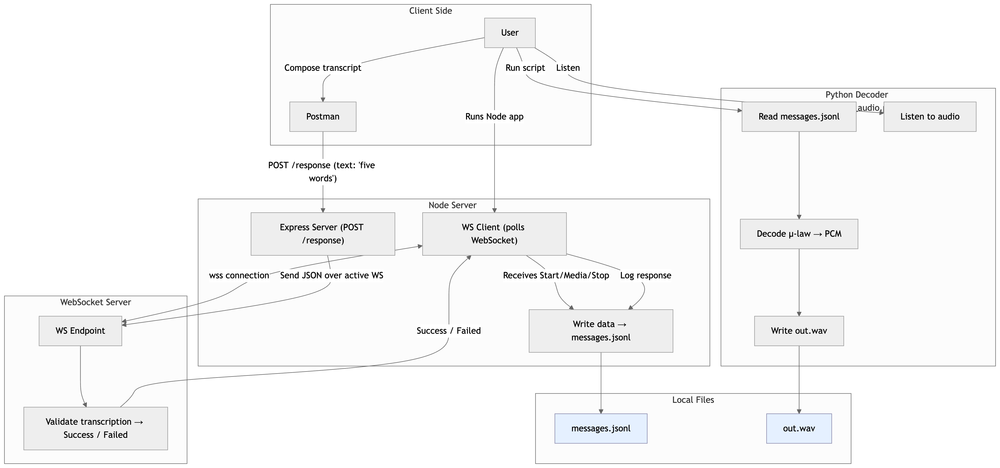

# hiyaChallenge

## The proccess:

First, I set up a super simple server with Express to listen on the websocket and poll for all the media encoded chunks.

Then, I also had to make sure to keep the server open and be able to write a POST so that I could send back an answer when I listened to the decoded media

I decided to use python to decode the the media because there are very useful and convenient libraries already available.

After listening to the decoded audio file, I simply enter the answer as a `POST` json body to `http://localhost:3000/response` and then get a `Success` event.

## To run:

First run the node server `node ws_client.mjs`

Then once the web socket has finished relaying the chunks, run `python3 decode_audio.py`.
